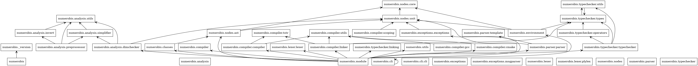

# Numerobis Programming Language

> [!WARNING]
> The language itself and especially its documentation is unfinished and while usable, it is not recommended to use it for production code.
> This documentation is work in progress.
> Only Linux is supported at the moment.


Install the Python package locally (editable):
```bash
make build
```

After installation, the `nbis` CLI entry point is available (see CLI usage below).


## Runtime & system dependencies

System dependencies (required for compilation and runtime linking):
- `pkg-config` (to discover `glib-2.0` and `bdw-gc`)
- `libglib2.0` development headers (commonly `libglib2.0-dev` on Debian/Ubuntu)
- `libgc` (Boehm GC) development headers (`libgc-dev` or `libgc1c2` + dev)
- C toolchain (gcc/clang), `ar` and `make` tools

- `ccache` and `mold` for runnning tests

Note: The build scripts use `pkg-config` to obtain correct compiler and linker flags for `glib-2.0` and `bdw-gc`.

```bash
sudo apt install -y \
  pkg-config \
  libglib2.0-dev \
  libgc-dev \
  build-essential \
  ccache \
  mold

```

## Running tests:
- The repository includes a simple runner used by the `Makefile`:
```bash
make test
# or
python3 run.py --verbose
```

Tests are .nbis files under `tests/`. The test runner executes them, checks outputs and expected behaviors (some tests include expected error codes).


## CLI (nbis)

The command line interface is available as the `nbis` entry point (installed by the package). Two primary subcommands are `build` and `view`:

- `nbis build SOURCE [-o OUTPUT] [--run] [--no-quiet] [--debug/--no-debug] -O {0,1,2,3,s}`
- `nbis view SOURCE [--output FILE] [--theme THEME] [--no-line-numbers]`

Run `nbis --help` for more information.


Examples:
- Compile `hello.nbis` into `hello`:
```bash
nbis build hello.nbis
```
- Compile and immediately run:
```bash
nbis build hello.nbis --run
```
- Show generated C (syntax-highlighted) without compiling:
```bash
nbis view hello.nbis
```


## Language & Syntax Reference

This section is WIP.

For concise examples, see the test-suite under `tests/` (these files serve as canonical examples and tests), as well as the `examples/` directory.

### Comments
`# comment`
Multiline comments:
```
#[ comment
another comment ]#
```

### Variables & type annotations
`x: Type = expr`
The type annotation is optional.

You can also pass a dimension:
```
x: Mass = 1000
```

More type annotations:
```
i: Int = 10
f: Float = 3.14
m: Int[Length] = 10 m
s: Str = "hello"
b: Bool = true
l0: List = [1,2,3]
l1: List[Int] = [1,2,3]
l2: List[Mass] = [1 kg, 2 kg, 3 kg]
fn: ![[s: Str, n: Int], Str] = !(s: Str, n: Int): Str = s * n
```

### Blocks
Blocks can be used to group statements together, e.g. in function bodies or if statements.

### Function definitions:

Functions support default arguments and optional parameter and return type annotations.
Their body can be a single expression or a block.

```
name!(a, b: Int, c: Str = "hello"): Str = a + (b -> Str) + c

fibonacci!(n: Int): Int = {
    if n <= 1 then
        return n
    return fibonacci(n - 1) + fibonacci(n - 2)
}

# Function call
echo(fibonacci(20))
```

### Lists and indexing
Lists are ordered, homogeneous collections of values.

- Lists: `[a, b, c]`
- Indexing: `lst[0]`, `lst[1:]`

Indexing is zero-based, and supports negative indices to access elements from the end. It copies Python's behavior.

### Custom units and dimensions
The following syntax can be used to define custom dimensions and units:
```
dimension Length            # Base dimension
dimension Volume = Length^3 # Derived dimension
unit m: Length              # Base unit
unit L = (0.1m)^3           # Derived unit, the dimension is determined automatically

# Shorthand notation for defining a new dimension “Taco” and the corresponding base unit “taco”
unit taco;
```

### If/Else

```
if condition then
    statement/expression1
else
    statement/expression2
```

```
a = 5
b = 10
if a < b then echo("small")
else {
    if a > 15 then echo("large") else echo("medium")
}
```

### Loops

Loop over a range
```
for i in 0..10 do {
    echo(i)
}
```

Loop over a list
```
for item in [1, 2, 3] do
    echo(item)
```

While loop
```
i = 0
while i < 10 do {
    echo(i)
    i = i + 1
}
```

### Conversions

Use the arrow `->` to convert a value to a different unit or type:

```
1m -> cm
```
```
5 -> Str
```


## Examples

- The `examples/` directory contains small programs:
  - `examples/factorial.nbis` — recursive factorial
  - `examples/caesar.nbis` — simple caesar cipher implementation
  - `examples/guessing.nbis` — number guessing game
  - `examples/sieve.nbis` — sieve of Eratosthenes
  - `examples/boiling.nbis` — energy required to boil water


### How much energy is required to boil a gallon of water at room temperature?

```python
from si import @(kg, L, g, K, kJ, kW, h, J)
from imperial import @gallon

unit °F = (5/9) * (_ K + 459.67);

unit cal = 4.184 J;
unit kWh = kW * h;

density_water = 1 (kg / L)  # at sea level
mass_water = 1 gallon * density_water

c_water = 1 (cal / (g * K))

ΔT = (212°F -> K) - (70°F -> K)

heat = mass_water * c_water * ΔT

echo("Energy boil a gallon of water at room temperature:")
echo(heat -> kJ)
echo(heat -> kWh)
```
```
Energy boil a gallon of water at room temperature:
1249.45 kJ
0.347071 kWh
```

### The delta operator
```python
unit mW = 0.001 W
unit dBm = 10^(_ mW / 10mW)

echo(2 * 60dBm)
echo(60dBm |+| 60dBm) # add the raw numbers, ignore unit
```
```
63.0103 dBm
120 dBm
```

### Affine temperature units

```python
unit °C: Temperature = _ K + 273.15;
unit °F = (5/9) * (_ K + 459.67);

echo(5°C)
echo(0°C -> K)
echo(0°C -> °F)
echo(0°C |-| 32 °F)
```
```
5 °C
273.15 K
32 °F
0 °C
```


## Project layout

- `src/numerobis/` — Python package containing compiler front-end, module system, CLI
- `runtime/` — C runtime sources; built into `libruntime.a`
- `tests/` — language tests and examples
- `examples/` — small example programs
- `scripts/` — helper scripts


