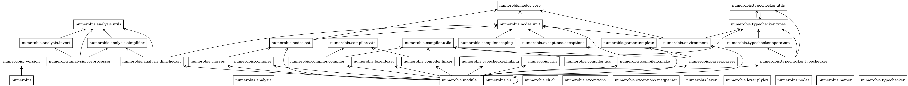

# Numerobis

A modern, compiled, statically-typed programming language that treats physical units and dimensions as first-class citizens of the type system. Dimension and unit errors are caught **before execution** — and unit conversions happen **automatically**.

> [!WARNING]
> The language and its documentation are unfinished. While usable, Numerobis is not recommended for production code yet. Only Linux is supported at the moment.

-----

## Why?

In most programming languages, physical quantities are plain numbers. Units exist only as informal convention, and there is no way to automatically detect unit inconsistencies — the kind of mistake that caused the [loss of the Mars Climate Orbiter](https://en.wikipedia.org/wiki/Mars_Climate_Orbiter) in 1999.

Numerobis integrates units and dimensions directly into its type system:

- **Dimension errors are caught at compile time** — adding a length to a mass is a type error.
- **Unit conversions are automatic** — you never write conversion factors by hand.
- **Non-multiplicative units are supported natively** — including affine units like °C and °F, and logarithmic units like dBm and pH.

Numerobis compiles to C99, giving it a significant performance advantage over interpreted languages.

-----

## Installation

Install the Python package locally (editable):

```bash
make install
```

Build the runtime library and compiler:

```bash
make build
```

After installation, the `nbis` CLI entry point is available.

### System dependencies

```bash
sudo apt install -y \
  cmake \
  pkg-config \
  libglib2.0-dev \
  libgc-dev \
  build-essential
```

- `cmake` – Used by the compiler and test runner to manage the build process
- `pkg-config` — discovers `glib-2.0` and `bdw-gc`
- `libglib2.0-dev` — dynamic lists and strings
- `libgc-dev` — Boehm–Demers–Weiser garbage collector
- `build-essential` — C toolchain

#### Graphics (optional)

For graphical programs (using the `graphics` module), install SDL2 and SDL2_ttf:

```bash
sudo apt install -y \
  libsdl2-dev \
  libsdl2-ttf-dev
```

- `libsdl2-dev` — windowing, input, rendering
- `libsdl2-ttf-dev` — font rendering support

Graphics support is automatically enabled when required.

#### CCache (optional)

To speed up repeated builds, install `ccache`:

```bash
sudo apt install ccache
```

You can then enable compiler caching via:

```bash
--cache
```

#### Benchmarks

To run benchmarks, install `hyperfine` for statistically robust timing:

```bash
sudo apt install hyperfine
```

### Editor Support

Numerobis provides syntax highlighting for VSCode. You can install the extension locally into your editor by running:

```bash
make highlight
```

This copies the syntax configuration directly into your `~/.vscode/extensions` directory

-----

## CLI Reference

### `nbis build`

**Usage:** `nbis build SOURCE [OPTIONS]`

| Flag | Default | Description |
| :--- | :--- | :--- |
| `-o`, `--output` | `src_name` | Output binary path. |
| `--run` / `--no-run` | `--no-run` | Execute the binary immediately after building. |
| `--quiet` | Off | Suppress non-essential compiler output. |
| `--debug` / `--no-debug` | `--debug` | Emit debug information (`-g`). |
| `-O {0,1,2,3,s}` | `0` | Optimization level passed to the C compiler. |
| `--cc` | `gcc` | C compiler to use (e.g., `clang`). |
| `--linker` | `None` | Set a specific C linker to use. |
| `--cmake` / `--no-cmake` | `--cmake` | Use CMake for build configuration. |
| `--ccache` / `--no-ccache`| `--no-ccache`| Use `ccache` to speed up recompilation. |

### `nbis view`

**Usage:** `nbis view SOURCE [OPTIONS]`

| Flag | Default | Description |
| :--- | :--- | :--- |
| `-o`, `--output` | *(stdout)* | Write generated C code to a file instead of printing. |
| `--theme` | `monokai` | Rich syntax highlighting theme. |
| `--line-numbers` / `--no-line-numbers` | On | Toggle line numbers in terminal output. |

-----

## Running Tests

Tests are executed via `run.py` (or `make test`). The runner parses `.nbis` files, checks for expected error codes, and measures performance.
The test suite currently contains 1,333 unit tests (all of which maintain a 100% pass rate).

**Usage:** `python3 run.py [TEST_NAMES...] [OPTIONS]` or `make test -- [TEST_NAMES...] [OPTIONS]`

### Output Options

- `-v`, `--verbose`: Show output for failed tests (default mode).
- `-f`, `--full`: Show output for **all** tests (passed and failed).
- `-p`, `--print`: Print the generated C code during the test run.
- `-F`, `--format`: Print C code with formatting applied.

### Execution Options

| Flag | Default | Description |
| :--- | :--- | :--- |
| `-j`, `--jobs` | `CPU Count` | Number of parallel jobs for test execution. |
| `--cc` | `gcc` | C compiler used for test binaries. |
| `--linker` | `None` | C linker used for test binaries. |
| `--no-cmake` | Off | Skip CMake and use direct GCC bindings (unstable). |
| `--no-lib` | Off | Skip re-building the static runtime libraries before testing. |
| `--ccache` | Off | Enable `ccache` for test compilation. |

### Targeted Testing

You can run specific test files by providing their names without the `.nbis` extension:

```bash
# Run only the echo and logic tests
make test -- echo logic
```

-----

## Language Reference

> For concise examples, browse the `tests/` directory (canonical examples) and `examples/`.

### Comments

```python
# single-line comment

#[ multi-line
   comment ]#
```

### Variables & Type Annotations

Type and dimension annotations are optional — the compiler infers them bidirectionally.

```python
x: Type = expr
x: Mass = 1000       # dimension annotation

i: Int   = 10
f: Num   = 3.14
m: Int[Length] = 10 m
s: Str  = "hello"
b: Bool = true
n: Num = 42          # 'Int' is a subtype of 'Num'!
l0: List        = [1, 2, 3]
l1: List[Int]   = [1, 2, 3]
l2: List[Mass]  = [1 kg, 2 kg, 3 kg]
fn: ![[s: Str, n: Int], Str] = !(s: Str, n: Int): Str = s * n
```

### Functions

Functions support default arguments. The body can be a single expression or a block.

```python
greet!(name: Str, times: Int = 1): Str = name * times

fibonacci!(n: Int): Int = {
    if n <= 1 then
        return n
    return fibonacci(n - 1) + fibonacci(n - 2)
}

echo(fibonacci(20))
```

### Global Variables

You can reference and modify variables in the outer scope from within functions using the `global` keyword.

```python
x = 5

f!() = {
    global x
    x = x * 2
}

f()
echo(x) # 10
```


### Control Flow

```python
# if / else
if a < b then echo("small")
else {
    if a > 15 then echo("large") else echo("medium")
}

# else if chains
if a < b then echo("small")
else if a == b then echo("equal")
else echo("large")

# for over a range
for i in 0..10 do echo(i)

# for over a list
for item in [1, 2, 3] do echo(item)

# while
i = 0
while i < 10 do {
    echo(i)
    i = i + 1
}

# loops with break and continue
while true do {
    i = i + 1
    if i >= 11 then {break}
    if i % 2 == 0 then {continue}
    echo(i)
}
```

### Lists & Indexing

Lists are ordered and homogeneous. Indexing is zero-based and follows Python conventions (negative indices, slices).

```python
lst = [10, 20, 30]
lst[0]   # 10
lst[-1]  # 30
lst[1:]  # [20, 30]

# Built-in list methods
lst.append(40)
lst.pop(0)
lst.insert(0, 42)
lst.extend([50, 60])
```

### Structs

Numerobis supports custom data structures. You can define fields, provide default values, and instantiate them using keyword arguments.

```python
struct Fruit {
    name: Str,
    size: Length = 10cm,
    edible: Bool = false
}

apple = Fruit("Apple", 10cm, true)
ananas = Fruit("Ananas", 30cm)

echo(apple.name)
echo(apple.size -> m)
```

### Methods

You can bind functions as methods directly to types via dot-syntax.

```python
Str.length!(self: Str) = 42
echo("test".length())

lst = ["test".len, ["t", "e", "s", "t"].len]
for fn in lst do
    echo(fn())
```

### Generics

Functions can accept generic type variables using the `?` prefix, allowing you to write flexible operations that enforce input-output relationships. Generics work for normal types and variables dimensions.

```python
id!(x: ?T): ?T = x
id(1) + 2
id("hello") + "!"

# Generic dimension enforcement
dimid!(x: Num[?D]): Num[?D] = x
```

-----

## Units & Dimensions

### Defining Dimensions and Units

```python
dimension Length             # base dimension
dimension Volume = Length^3  # derived dimension

unit m: Length               # base unit for Length
unit km = 1000 m             # derived unit (dimension inferred)
unit L  = (0.1 m)^3          # volume in litres

unit taco;                   # shorthand: creates dimension "Taco" and base unit "taco"
```

### Unit Suffixes on Literals

Units are **suffixes on number literals**, not standalone values. This avoids naming conflicts (e.g. `m` can still be used as a variable name).

```python
m = 410 kg         # 'm' is a variable, 'kg' is a unit suffix — no conflict
```

A unit suffix extends up to one space from the number, or arbitrarily far inside parentheses:

```python
# "5 metres divided by variable s"
5 m / s
5m / s

# "5 metres per second"
5m/s
5 m/s
5(m / s)
```

Allowed operators **inside suffixes**: `*`, `/`, `^`

### Affine Units (e.g. Temperature)

```python
unit °C: Temperature = _ K + 273.15
unit °F = (5/9) * (_ K + 459.67)

echo(0°C -> K)    # 273.15 K
echo(0°C -> °F)   # 32 °F
```

The underscore `_` is the placeholder for the input value. Every unit definition is a function that maps a value to its base unit.

### Logarithmic Units (e.g. Decibels)

```python
unit mW  = 0.001 W
unit dBm = 10^(_ mW / 10mW)

echo(2 * 60dBm)          # 63.0103 dBm
echo(60dBm |+| 60dBm)    # 120 dBm      (raw number addition, ignores unit)
```

### The Delta Operator

For affine and logarithmic units, plain `+` and `-` are semantically restricted. The delta operators `|+|` and `|-|` operate on raw values and reattach the unit afterwards:

```python
0°C |-| 32°F    # 0 °C
10dB |+| 5dB    # 15 dB
```

### Unit Conversions

Use `->` to convert between compatible units or between types:

```python
500 m -> km          # 0.5 km
1 gallon -> L        # 3.78541 L
"1234" -> Int        # 1234 (type conversion)
("1234" -> Int) + 1  # 1235
```

Conversions between incompatible dimensions are caught at compile time.

### Imports

Import with the `@` prefix to distinguish units/dimensions from regular names. You can also import native standard library modules using standard dot-syntax.

```python
from mymodule import name, @myunit, @MyDimension
from imperial import @gallon

# grouped import shorthand
from si import @(kg, m, km, s, K, J, kJ, kW, h, rad)

# dot-syntax module imports
import math
import random

echo(math.sin(1 rad))
```

-----

## Type System

`Int` is a subtype of `Num`. Values of type `Int` can be assigned to variables of type `Num` and are automatically promoted. The inverse assignment requires an explicit conversion.

### Dimension Annotations

```python
x: Length = 42 m
y: Num[Mass] = 3.14 kg
l: List[Length] = [x, 6 m, 7 km]
```

### Compile-Time Errors

```
'm' declared as [Mass] but has dimension [Length]
m: Mass = 2m
```

```
Incompatible dimensions in addition: [Mass·Length²·Time⁻³] vs [Mass·Length²·Time⁻²]
42 watt + 3.14 joule
```

### Interop with C

External C functions can be declared and called from Numerobis using the `extern` keyword:

```python
extern echo!(value, end: Str = "\n"): None;
```

-----

## Examples

### Energy to Boil a Gallon of Water

```python
from si       import @(kg, L, g, K, kJ, kW, h, J)
from imperial import @gallon

unit °F  = (5/9) * (_ K + 459.67)
unit cal = 4.184 J
unit kWh = kW * h

density_water = 1 (kg / L)
mass_water    = 1 gallon * density_water
c_water       = 1 (cal / (g * K))
ΔT            = (212°F -> K) - (70°F -> K)
heat          = mass_water * c_water * ΔT

echo(heat -> kJ)    # 1249.45 kJ
echo(heat -> kWh)   # 0.347071 kWh
```

### Logarithmic Unit Addition

```python
unit mW  = 0.001 W
unit dBm = 10^(_ mW / 10mW)

echo(2 * 60dBm)         # 63.0103 dBm
echo(60dBm |+| 60dBm)   # 120 dBm
```

### Affine Temperature Conversions

```python
unit °C: Temperature = _ K + 273.15
unit °F = (5/9) * (_ K + 459.67)

echo(5°C)           # 5 °C
echo(0°C -> K)      # 273.15 K
echo(0°C -> °F)     # 32 °F
echo(0°C |-| 32°F)  # 0 °C
```

---

### Graphics and Simulations

The standard library provides a `graphics` module for creating windows, drawing shapes, and handling user input. It is well suited for interactive visualizations, small games, and physics simulations.

A good starting point is the example collection, especially [ball.nbis](examples/ball.nbis) and [scaling.nbis](examples/scaling.nbis), which demonstrate animation, coordinate transformations, and real-time rendering.

---

## Standard Library

The standard library is still evolving and does not yet have complete reference documentation. For now, the best overview of available functionality is the source itself: [src/numerobis/stdlib/](src/numerobis/stdlib/).

### Modules

- `builtins` – core functions and methods available in every program
- `constants` – physical and mathematical constants (planned to grow)
- `graphics` – SDL2-based rendering and input handling, similar in spirit to pygame
- `imperial` – imperial units of measurement
- `information` – units for digital information (bit, byte, etc.)
- `math` – mathematical functions
- `random` – random number generators and probability distributions
- `si` – SI units and dimensions
- `time` – timing utilities


-----

## Project Layout

```
src/numerobis/
  analysis/      — dimension checker, unit simplifier, inversion
  cli/           — nbis command-line entry point
  compiler/      — codegen, linker, scoping, C emission
  lexer/         — tokeniser
  nodes/         — AST node definitions
  parser/        — recursive-descent parser + unit expression parser
  typechecker/   — type inference, dimension algebra, operator rules
  stdlib/        — built-in modules
runtime/         — C runtime sources, built into libruntime.a
tests/           — language tests, benchmarking
examples/        — small example programs
highlighting/    – VS Code syntax highlighting extension
scripts/         — build helpers
assets/          — generated diagrams
```



